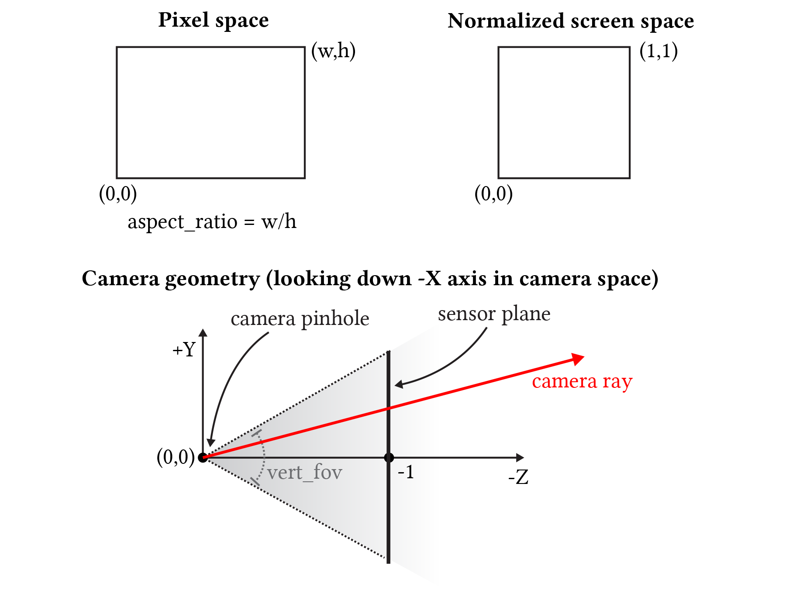
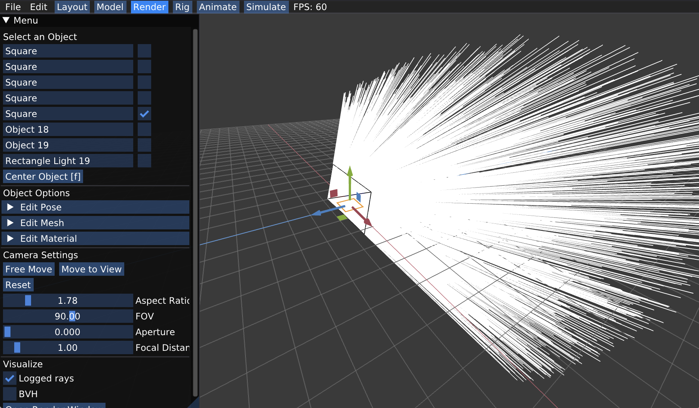

# (Task 1) Generating Camera Rays

"Camera rays" emanate from the camera and measure the amount of scene radiance that reaches a point on the camera's sensor plane. (Given a point on the virtual sensor plane, there is a corresponding camera ray that is traced into the scene.)

To get started take a look at `Pathtracer::trace_pixel` in `student/pathtracer.cpp`. The job of this function is to compute the radiance arriving at a point within pixel of the image. Conveniently, we've given you a function `Pathtracer::trace_ray(r)` that provides a measurement of incoming scene radiance along the direction given by ray `r`. See `lib/ray.h` for the interface of ray (`r.point` is the ray origin, `r.dir` is the ray direction).  

__Your job in Task 1 is to generate the ray `r` that is passed to `trace_ray(r)`.__

Here's how to do it:

The following diagram illustrates pixel space and normalized screen space in the ray tracer. Note that unlike Assignment 1 (0,0) is the bottom-left of the image in these coordinate spaces. The bottom part of the diagram illustrates the region seen by the camera in camera space coordinates. Note the pinhole of the camera is at the origin, and the camera is looking down the -Z axis. The sensor plane is located at Z=-1.  Also note that the sensor in this diagram is placed in front of the camera. This is intentional, since tracing a ray from the pinhole through this "virtual" sensor plane is equivalent to tracing a ray _through the pinhole from a corresponding point on a sensor plane behind the pinhole_, but since the virtual sensor is in front of the pinhole, there's no need to invert the image.  

Something to think about: Given this diagram, how would you compute the corners of the sensor plane given the field of fov (`vert_fov`) and aspect ratio of the screen? 

**Step 1: Compute a normalized screen space point.** Given the width and height of the screen, and point in pixel space, compute the corresponding coordinates of the point in normalized ([0-1]x[0-1]) screen space in `Pathtracer::trace_pixel`. Pass these coordinates to the camera via `Camera::generate_ray` in `camera.cpp`.

Your implementation of `Pathtracer::trace_pixel` must support super-sampling. The starter code provided to you will call `Pathtracer::trace_pixel` once for each sample (given by `Pathtracer::n_samples`) and resolve the results to compute final pixel values. Your implementation of `Pathtracer::trace_pixel` must choose a new location within the pixel for each sample. This is equivalent to saying that the ray tracer wil shoot `n_samples` camera rays per pixel.

When the renderer is configured to use 1 sample per pixel (`Pathtracer::n_samples`), your implementation should sample incoming radiance at the center of the specified pixel by constructing a ray `r` that begins at this sensor location and travels through the camera's pinhole. When the renderer is configured to use more than one sample per pixel, your implementation should choose a unique random location in the specified pixel for each ray. To choose a sample location within the pixel, please implement `Rect::Uniform::sample` (see `src/student/samplers.cpp`), such that it provides (random) uniformly distributed 2D points within the rectangular region specified by (0,0) and `Rect::Uniform::size.x` and Rect::Uniform::size.y. Once you've done this, your implementation of `trace_pixel` can create `Rect::Uniform` sampler with a one-by-one region and call `sample()` to obtain randomly chosen offsets within the pixel.  You'll need to convert this pixel-space 2D location to a normalized screen-space location prior. to calling `Camera::generate_ray`.

**Step 2: Implement `Camera::generate_ray`.** This function should return a ray **in world space** that reaches the given sensor sample point. We recommend that you compute this ray in camera space (where the camera pinhole is at the origin, the camera is looking down the -Z axis, and +Y is at the top of the screen.). In `util/camera.h`, the `Camera` class stores `vert_fov` and `aspect_ratio` indicating the vertical field of view of the camera (in degrees, not radians) as well as the aspect ratio. Note that the `Camera` class maintains camera-space-to-world space transform matrix `iview` that will be fairly handy. 

**Tip:** We give you `vert_fov` in degrees, but common C functions like `arctan` accept values in radians! 

**Tip:** Since it can be hard to know if you camera rays are correct until you implement primitive intersection, we recommend debugging your camera rays by checking what your implementation of `Camera::generate_ray` does with rays at the center of the screen (0.5, 0.5) and at the corners of the image (0,0) and (w,h).

The starter code can log the results of raytracing for visualization and debugging. To do so, simply call function `Pathtracer::log_ray` in your `Pathtracer::trace_pixel`. Function `Pathtracer::log_ray` takes in 3 arguments: the ray thay you want to log, a float that specifies the time/distance to log that ray up to, as well as the color to render the ray as. If not provided, the color as it is being set to white by default. If you draw all rays, you won't be able to see much about what's going on. Instead we rercommend you only log only a portion of the generated rays for a better visualization. For example the following code will log 0.05% of generated camera rays:

    if (RNG::coin_flip(0.0005f))
        log_ray(out, 10.0f);

In the Render mode of the app, you can visualize the logged rays by checking the box for "Logged rays" under Visualize and then **start render** (Open Render Window -> Start Render). After running the ray tracer, rays will be shown as lines in visualizer. Be sure to wait for rendering to complete so you see all rays while visualizing. A message is printed to standard output on completion. 

Once you have implemented `Pathtracer::trace_pixel`, `Rect::Uniform::sample` and `Camera::generate_ray`, you should have a working camera.

**Extra credit ideas:**

* How would you simulate a camera with a finite aperture instead of a pinhole camera.  If you did this, you'd be able to simulate real camera effects like [defocus blur](https://gfxcourses.stanford.edu/cs348k/spring22/lecture/camerapipeline3/slide_39) and [depth of field](https://gfxcourses.stanford.edu/cs348k/spring22/lecture/camerapipeline3/slide_40).

* Write your own sampler that generates camera ray samples with improved distributions. Some example terms to Google include:
  * Jittered Sampling
  * Multi-jittered sampling
  * N-Rooks (Latin Hypercube) sampling
  * Sobol sequence sampling
  * Halton sequence sampling
  * Hammersley sequence sampling
